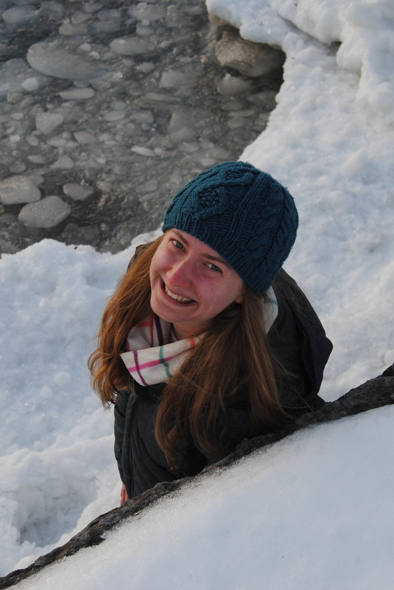

## Welcome to my personal webpage!
I am currently a PhD student in the University of Colorado Boulder's [Ecology and Evolutionary Biology (EBIO) Department](https://www.colorado.edu/ebio/). I am also an Integrated Data Science Fellow in the [Interdisciplinary Quantitative (IQ) Biology Certificate Program](https://www.colorado.edu/certificate/iqbiology/) at CU.

## Research interests
* evolutionary ecology
* climate change
